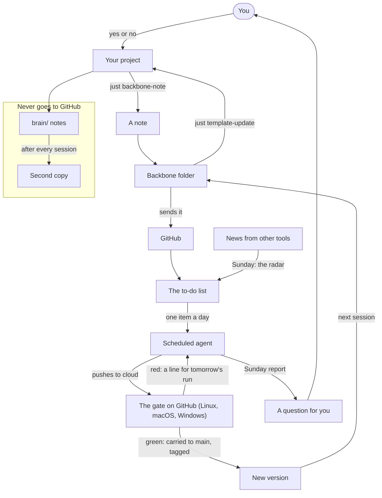
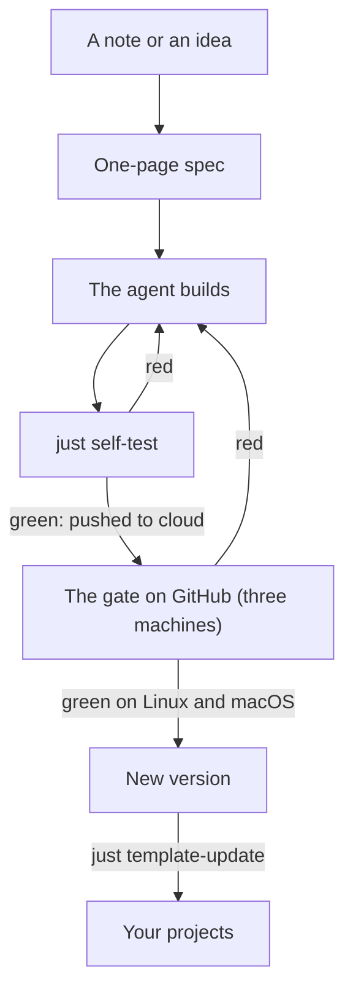

# How it works

Two pictures, for a person who does not read code. GitHub draws them by itself
from the text in this file, so there is no image to keep current: when the
backbone changes, the words below change and the picture follows.

## The loop

Start at **Your project**. An agent working there notices something about the
backbone (a fault, a gap, an idea) and leaves a note with
`just backbone-note`. The note lands in the backbone folder that sits next to
your projects, and that folder sends it to GitHub, where it joins the to-do
list (`docs/backlog.md`). A scheduled agent takes one item from that list every
day, builds it, tests it and pushes it to the branch `cloud`. A gate on GitHub
tests that push again on a clean Linux, a clean Mac and a clean Windows
machine; Linux and macOS decide, Windows only reports for now. Green is
carried to `main` and becomes a new version, tagged; red leaves one line that
the next day's run reads first and fixes. On Sunday the agent looks outward
instead: the radar reads what the tools around the backbone have released and
adds what matters to the same list, as ideas. The next time an agent opens any
of your projects, the backbone folder takes the new version from GitHub. The
agent in that project sees "behind" and takes the version in with
`just template-update`. You never open the backbone folder; it only has to
stay where it is.

Two smaller loops run beside the big one. What only you can decide waits on
the list as a line that begins `- [?]`, never more than three of them. Sunday's
report asks you the oldest one as a question that yes or no answers, you tell
the answer to the agent in any project, and it travels back as a note that
begins `decision:`. And `brain/`, your private notebook, never goes to GitHub.
It stays on your computer, and after every session a second copy of it is left
in the place you named once for this machine.

## The life of one idea

Every change to the backbone goes the same way, whoever starts it. A note from
a project, or an idea the radar brought in, becomes a one-page spec in
`docs/specs/` when it is bigger than a small fix. The agent builds it, and
`just self-test` tries it out on throwaway projects. Red means it is not saved,
and the agent goes back to building. Green is pushed to the branch `cloud`,
where GitHub runs the same suite on a clean Linux, Mac and Windows machine.
When Linux and macOS are green it becomes a new version on `main`, tagged, with
an entry in `CHANGELOG.md`, and each of your projects takes it in the next time
an agent works there. Whatever would change something you type waits for your
yes first, as a question in the loop above.
